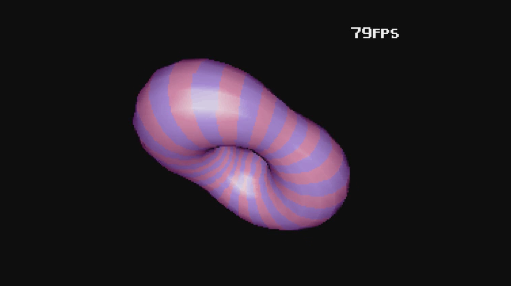

# Amiga-3D
Oldschool demoscene 3D-routines for Amiga computers

# What is Amiga-3D and what purpose it is for
Amiga-3D is a collection of various routines that together can be used to build working simple 3D-engine with rotating and software shading. With routine you can enjoy realtime calculated 3D-objects on your retro Amiga system.
Routines are written in Motorola 68020+ assembly that can build using AsmOne/AsmPro or VASM compilers.

# Required software and hardware
Building can be done either in Amiga-environment or cross-compiled in Windows, Linux or Mac-environment using VASM assembler (vasmm68k_mot).
Execution requires an Amiga computer with AGA-chipset (Amiga 1200 or 4000) with fast as possible CPU (68060 preferred) and 68881/2 FPU and some fast RAM also. If you do not have an accelerated AMIGA you may try an SoftFPU emulation like softieee (https://aminet.net/package/util/libs/SoftIEEE). Due to the high need of core CPU/FPU power a PiStorm32, Apollo Vampire, Pimiga or emulation like WinUAE/FS-UAE emulator are highly recommended.

# Building the program
Easiest to build the program is using AsmPro/AsmOne compiler where you need just to load the **main.s** source-code in to the editor by selecting folder with command **v foldername** and reading the actual source-code with command **r main.s**. Then compiling the source with command **a**. After successful compiling you can optionally create an executable file with command **wo filename**. You can either run the program from an editor with command **j**. Or running the executable from CLI.
Alternately you can build the program using your cross-compiling environment with following command:
**vasmm68k_mot -m68040 -Devpac -fhunkexe main.s -o main.exe**
and after successful compilng copy the executable file to your Amiga and run it from CLI.

# The Source Code
Sources for this program are splitted in to multiple files. File names describes what they do.
Let's walk through every file to get a better overview about everything and how they work together.

# main.s:
This is the main source file and has all configurable variables, pointers and data. It has a label **initialize:** that is being called during the initialization and then is label **main:** that runs the actual program including the **mainloop:** that loops until left mouse button is pressed. Then is **vbl_subroutine** that is being calleed once per frame by the vertical blanking interrupt. **wait_vbl**-rotine is for waiting the VBI occurrence. **swap_screen**-routine rotates triplebuffered screen pointers updating also the current showscreen to the copperlist. **make_sinus_fpu** does create peak-maximized 16-bits integer tables for Sinus and Cosinus (2048 values per table). **clear_screen** clears the chunky screen buffer. **sort_surfaces** builds the Z-buffer of average Z-values of each surface. **quicksort** does sort Z-buffer in reverse order so we can draw surfaces from back to front. **rotate_object** does the spinning over all three axis. Rest of the main.s are data-pointers and variables and copperlist and all of the buffers needed.
# init.s:
In this code we take over the system, setup Vertical Blanking Interrupt and then call the main program. When main program exits, we restore the systewm status back as it was when the program started.
# object.s:
this file has routines for 3D object creation. The first is **make_vertices** that calculates a torus shape object with configurable modifiers
using Sin and Cos tables. Vertices are in simple signed word form X, Y, Z. Then is **make_surfaces** that defines all required triangles, defining the color of the triangle (actually palette offset added by brightness during draw) followed by vertices of the triangle. Then is the most complex part of the object creation -- creating the normal vector coordinates. It does calculate the surface normals first computing two edge vectors, then computing the normalized cross-products for face normals and then cumulate them for each connecting vertices to get the vertex normals. And finally normalize the vertex normals.
# c2p.s:
This file has code for doing Chunky to Planar coversion to the screen. This code was generally made public and available for use by Michael Kalms in the 90's. Purpose for this code is to make screen writing more efficient as Amiga uses Planar-mode to show graphics. Bitplanes are stacked together and pixel color comes from the bits enabled in the bitplanes. In chunky mode, one byte is used for each pixel. Drawing to chunky screen is lots of faster than setting bits on sepzarate bitplanes in Planar mode.
# colors.s:
In this file are several routines for handling AGA-colors and palette. Palette is a table of 256 long words, defining 256 colors of 24-bit RGB-values. Each palette color is a longword having 8-bits red color component, 8-bits green color component and 8-bits blue color component. To set the palette, there is a routine **make_colors**. That routine does apply the dimming for the colors and then apply the AGA color value. The way how AGA colors are handled is a bit complicated. That's why we have a routine **set_aga_color** that does split the color values in the nybbles and also handles selection of the wanted color index in the palette. Then we have **clear_palette**-routine that resets the entire palette with a RGB-color given in D0. Last but not least routine in colors.s is **make_ramp**, that does create color gradients in to the palette. It uses gradient configurations and size parameters in the registers on call. Make_ramp does interpolate given RGB-color values within given range- Gradients table is in the **main.s** file and it has two longwords data for the gradient. Gradient-parameters are RGBI-values where the I is intensity of the color. $00 is the minimum intensity and produces black and $ff is the maximum and produces the configured RGB-value.
# rotate.s:
This file does all the 3D rotation math. For the accuracy and the performance, FPU is being used. **rotate_vertices** reads the current angles for X,Y,Z and does calculate the rotation for all vertices. Rotation produces 2D projected X and Y coordinates and Z-distance value that will be used for Z-buffering. After vertices we rotare polynorms with same angles to get the lighting volumes for each vertex.
# draw.s:
This file contains the most complicated parts of these routines. **draw_all** routine draws all visible surfaces in order from back to front. This routine does the backface culling check that detects is the surface visible (backface down) or hidden (backface up). This saves lots of CPU time bypassing the actual drawing of hidden surfaces. **gouraud_triangle** routine does exactly what it says, it draws triangle with gouraud shading. At first we sort all three vertices in Y-order. Then we will draw three virtual lines using **triangle_line** into the left and right buffers, interpolating the colors between vertices and storing the information for the actual shader that performs the scanline fill. Scanline filling is in the end of gouraud_triangle routine and the shader performance comes from highly optimized inner-loop of the shader code.
# fps.s:
contains graphics for printing digits and simple code that does print two-digits of frames per second value on the chunky screen.
